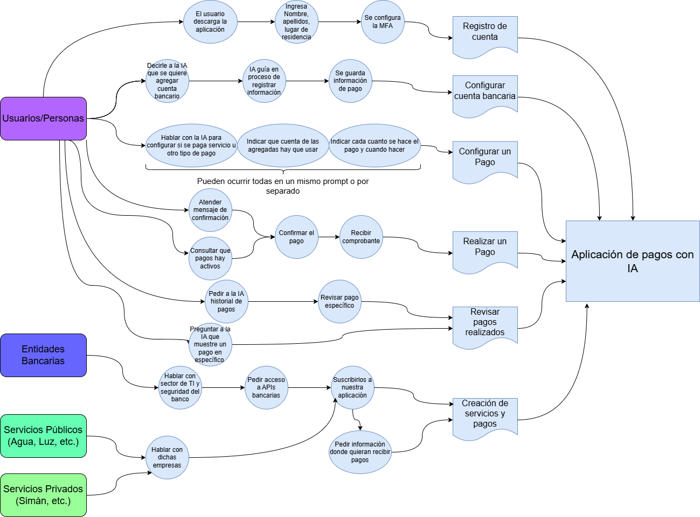

# Caso 1
Integrantes:
- Santiago Chaves Garbanzo 
- Anthony Fuentes

## 1

### Google Sprint

Es una metodología desarrollada por google para solucionar problemas de diseño en proyectos. Facilita el trabajo en equipo por medio de entregables. Usualmente es un proceso que dura 5 días en los cuales se desarrolla una idea sus desafios y como llevarla a cabo

### Design Thinking

Es también una tecnología hecha para generar soluciones donde se pasa por cinco fases: Empatía, Definición, Ideado, Prototipación y Validación. Gracias al enfoque en fases favoreces generar un sistema iterativo en caso de desear hacer revisiones a futuro. Además su enfoque al usuario permite garantizar que se cumplirá lo acordado.

## 2

## 3

### Interacción con la IA
- Hace referencia a todo momento en el que se hable con la IA
- Se evidencia que en muchos momentos del workflow el chat de IA es quien lleva la batuta
- Hace falta que no solo se pueda interactuar con la voz, que también se habilite chat para usar en momentos donde no se puede hablar

#### Acciones para garantizar
- Que la IA tenga completo entendimiento de lenguaje natural
#### Si este estado falla
- Si la IA no reconoce correctamente los comandos, causará frustración en los usuarios así como la pérdida de confianza en la aplicación si hay errores en sus transacciones.

### Registro de usuarios
- Si el usuario no se registra no podrá realizar ninguna acción en el sistema, es la raíz de toda acción.
- Además, la configuración de MFA es la garante de que haya seguridad en la aplicación.
####	Acciones para garantizar 
- Implementar autenticación de multi factor con biometría, Pin y Token SMS.
-Asegurar que todo usuario pueda ser registrado.
#### Si este estado falla
- Se pierde el punto de entrada inicial al sistema.
- Si hay riesgos de fraude los usuarios no usarán la aplicación.

### Revisión de pagos realizados
- Es importante que el usuario pueda encontrar y pueda solicitar en todo momento que pagos desea realizar.
- Ya sea que quiere ver el historial, o bien si desea saber si se realizó por error un pago que el usuario no deseaba.
#### Acciones para garantizar
- Un historial disponible en todo momento que dure 5 años antes de borrarse.
#### este estado falla
- Desconfianza en sí la aplicación está haciendo uso legítimo del dinero de los usuarios.

## 4
Modulos y pantallas cruciales:
- El estado/módulo del chat.
- El estado/módulo del historial.
- El estado/módulo de registro.

