# Caso 1
Integrantes:
- Santiago Chaves Garbanzo 
- Anthony Fuentes

## 1.

### Google Sprint

Es una metodología desarrollada por google para solucionar problemas de diseño en proyectos. Facilita el trabajo en equipo por medio de entregables. Usualmente es un proceso que dura 5 días en los cuales se desarrolla una idea sus desafios y como llevarla a cabo

### Design Thinking

Es también una tecnología hecha para generar soluciones donde se pasa por cinco fases: Empatía, Definición, Ideado, Prototipación y Validación. Gracias al enfoque en fases favoreces generar un sistema iterativo en caso de desear hacer revisiones a futuro. Además su enfoque al usuario permite garantizar que se cumplirá lo acordado.

## 2.

## 3.

### Interacción con la IA
- Hace referencia a todo momento en el que se hable con la IA
- Se evidencia que en muchos momentos del workflow el chat de IA es quien lleva la batuta
- Hace falta que no solo se pueda interactuar con la voz, que también se habilite chat para usar en momentos donde no se puede hablar

#### Acciones para garantizar
- Que la IA tenga completo entendimiento de lenguaje natural
#### Si este estado falla
- Si la IA no reconoce correctamente los comandos, causará frustración en los usuarios así como la pérdida de confianza en la aplicación si hay errores en sus transacciones.

### Registro de usuarios
- Si el usuario no se registra no podrá realizar ninguna acción en el sistema, es la raíz de toda acción.
- Además, la configuración de MFA es la garante de que haya seguridad en la aplicación.
####	Acciones para garantizar 
- Implementar autenticación de multi factor con biometría, Pin y Token SMS.
-Asegurar que todo usuario pueda ser registrado.
#### Si este estado falla
- Se pierde el punto de entrada inicial al sistema.
- Si hay riesgos de fraude los usuarios no usarán la aplicación.

## 4.
Modulos y pantallas cruciales:
- El estado/módulo del chat.
- El estado/módulo del historial.

## 5.

### Wireframe de registro
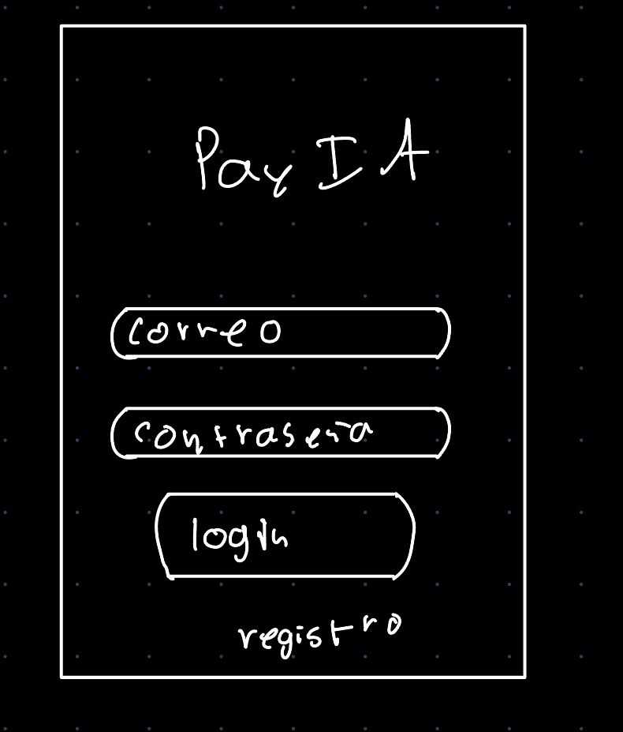

### Wireframe de interacción de voz
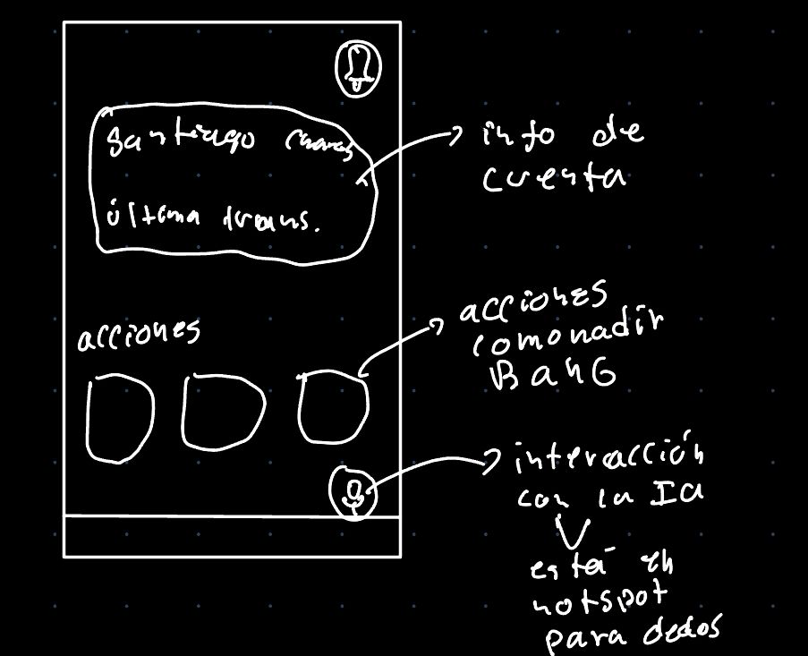

## 6.

Cree las pantallas a modo mockup o mimic utilizando alguna AI que genere código en el lenguaje que haya seleccionado en el entregable #1. Si ninguna AI genera para ese lenguaje, entonces proceda a utilizar plantillas para crear las pantallas diseñadas.

### Inicio de Sesión 
https://preview--paymate-ui.lovable.app/login
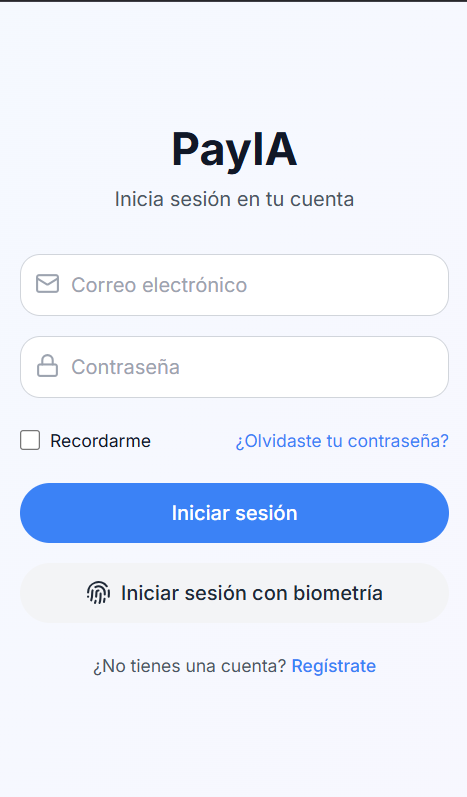

### Pantalla Principal 
https://preview--minimal-pay-ui.lovable.app/
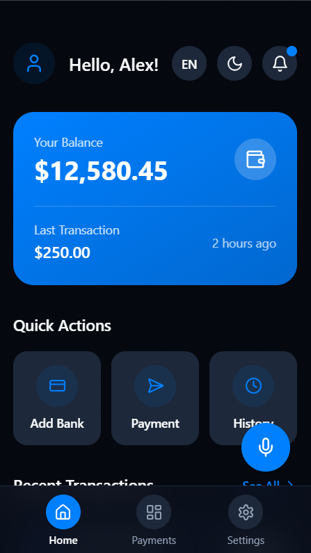
### Pantalla pricipal Español 
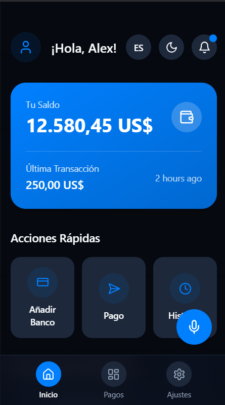

## 7. 
Proceda a realizar un test de usabilidad con al menos 3 personas (que no sean estudiantes del Tec), de las pantallas diseñadas utilizando alguna herramienta de testing de usuabilidad digital en la nube, recopile los resultados.

Se realiza un test de usabilidad en la plataforma de loop11 para evaluar a nuestro publico objetivo con el link directo de la previsualización dada por Loveable 
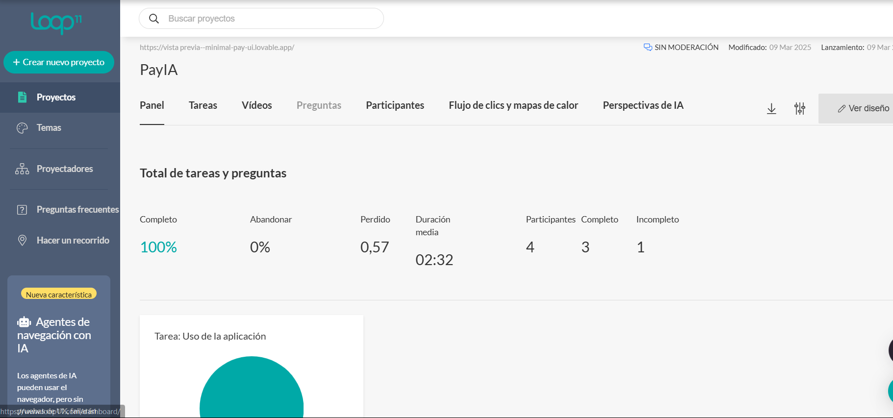

En la siguiente imagen que obtuvimos con las personas que realizaron el test, nos damos cuenta que el lugar de más interacción fue en el saldo de la cuenta, el segundo lugar en las configuraciones de idioma y luminocidad y por ultimo notamos una casi nula interacción en el area de microfono e interacción con la IA
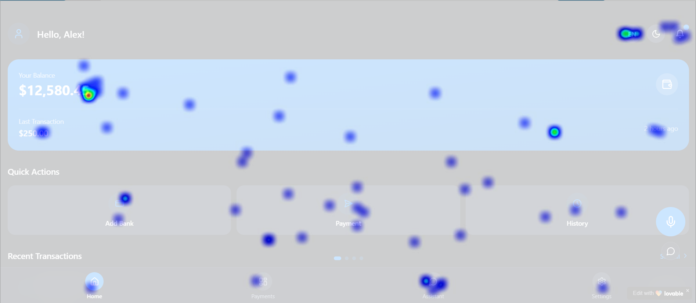

En un entorno más apropiado para nuestra aplicación, el boton del chat de voz no se ve tan desapercibido y es más utilizado por los usuarios, por lo que su integración en un entorno computacional aun puede recibir mejoras. 

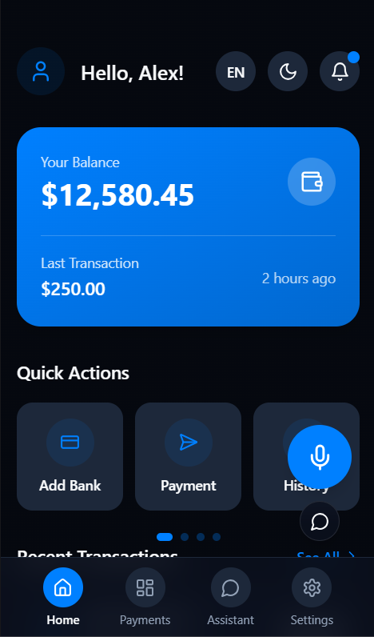

## 8. 
Documenten todo el entregable del punto 1 al 7 en un md file en github, dividiendose el trabajo a su criterio. Debe ser evidente los commits de cada integrante en las diversas secciones del documento md. Solo un md file. En la documentación debe dejar claro las evidencias de que las pruebas de usabilidad se hicieron con personas reales no estudiantes del Tec. Fotografías de personas frente a una computadora no es evidencia, no debe caber duda en la evidencia de que esa persona hizo esa prueba.

#### Las siguientes personas no son estudiantes del TEC y aceptaron participar en la prueba de usabilidad. 
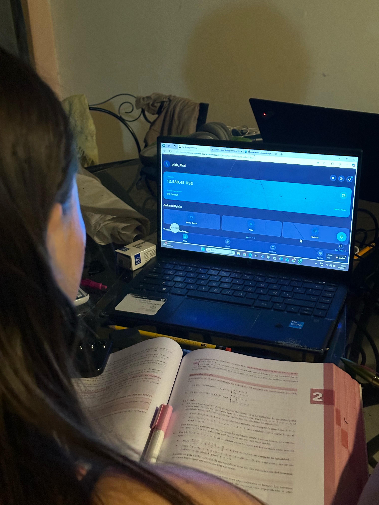

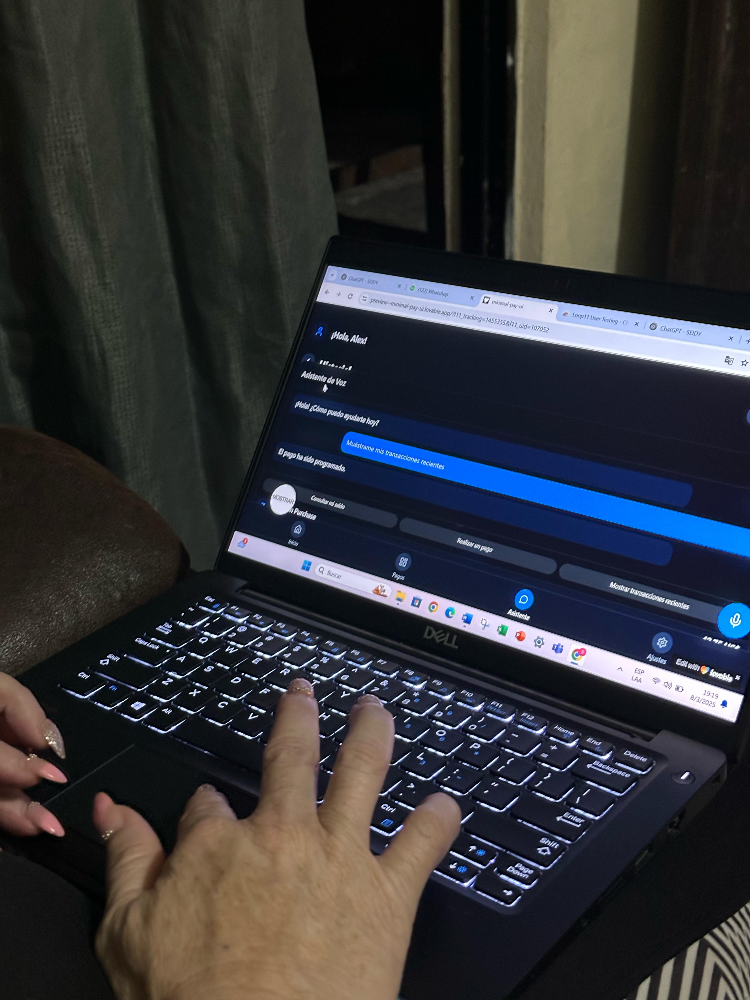
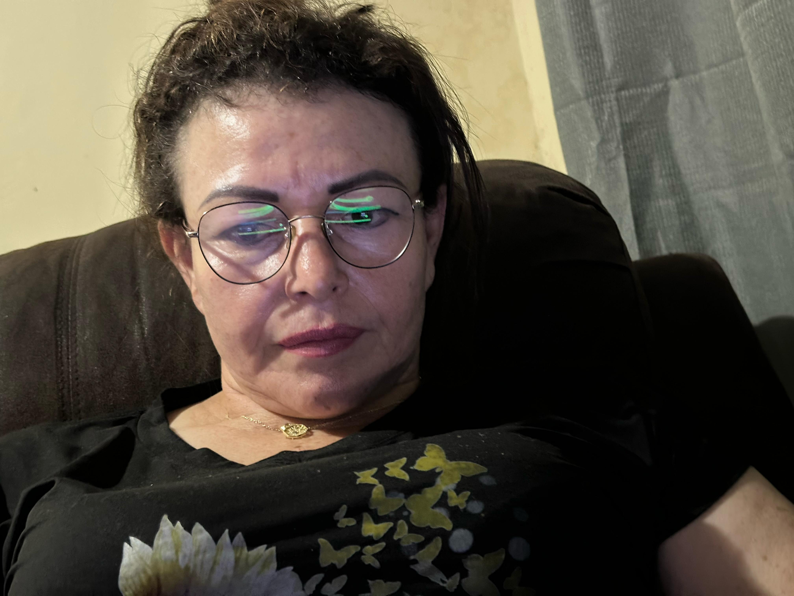
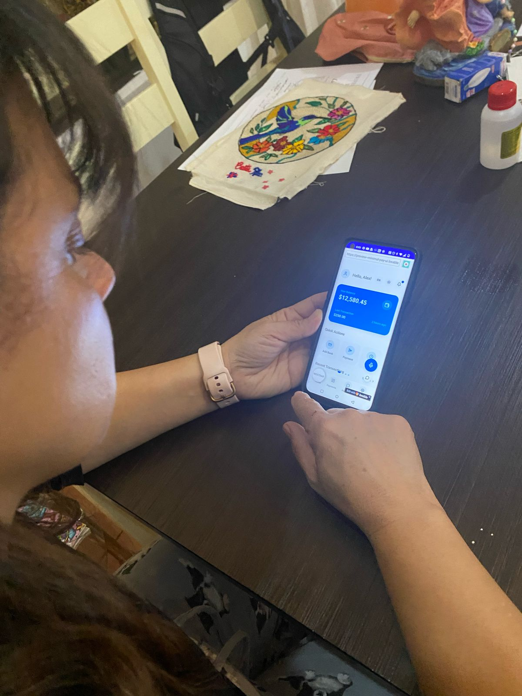
